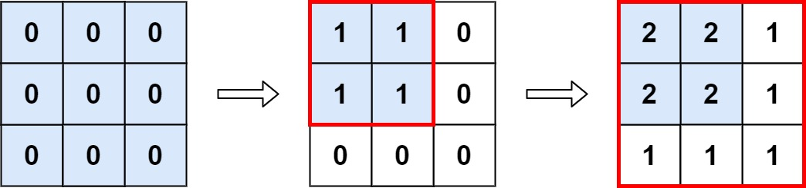

# Range Addition

You are given an `m x n` matrix `M` initialized with all `0's` and an array of operations `ops`, where `ops[i]` = [ai, bi] means `M[x][y]` should be incremented by one for all 0 <= x < ai and 0 <= y < bi.

Count and return the number of maximum integers in the matrix after performing all the operations.

*Example 1:*

    Input: m = 3, n = 3, ops = [[2,2],[3,3]]
    Output: 4
    Explanation: The maximum integer in M is 2, and there are four of it in M. So return 4.

*Example 2:*

    Input: m = 3, n = 3, ops = [[2,2],[3,3],[3,3],[3,3],[2,2],[3,3],[3,3],[3,3],[2,2],[3,3],[3,3],[3,3]]
    Output: 4

*Example 3:*

    Input: m = 3, n = 3, ops = []
    Output: 9

*Constraints:*

- 1 <= m, n <= 4 * 104
- 1 <= ops.length <= 104
- ops[i].length == 2
- 1 <= ai <= m
- 1 <= bi <= n

